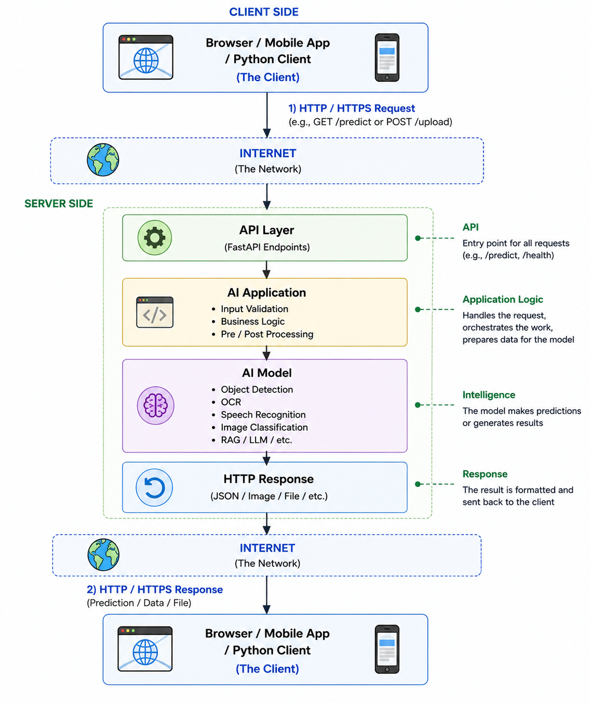
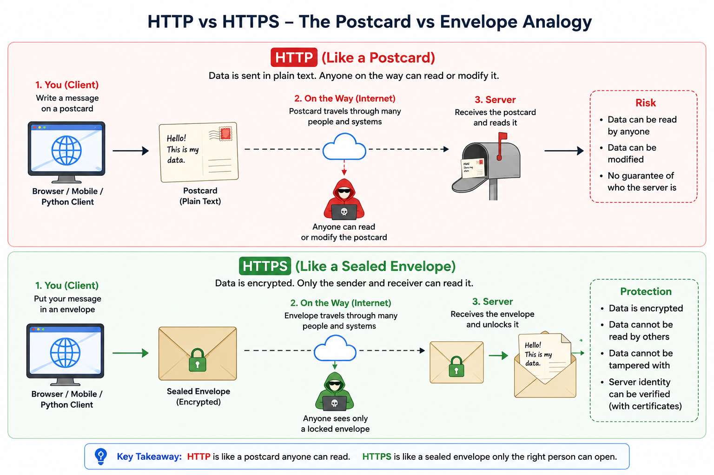

# Chapter 03: How Do Clients and Servers Communicate?

## Objective

By the end of this chapter, you should understand:

- why computers need a **communication protocol**,
- what **HTTP requests** and **HTTP responses** contain,
- what happens when text, image, speech, or video data is uploaded,
- what **HTTPS** adds on top of HTTP,
- where **FastAPI** fits in this communication flow.

## The Big Question

In the previous chapter, we learned that a **client** sends a request to a **server**.

But how do two different computers understand each other?

They need a shared set of rules.

That shared set of rules is called a **protocol**.

> **Mental model**
>
> A protocol is a common language that computers agree to use.

## What Is HTTP?

**HTTP** stands for **HyperText Transfer Protocol**.

HTTP defines how clients and servers exchange messages. It is used for:

- web pages,
- images,
- audio,
- video,
- JSON data,
- AI requests,
- AI responses.

Whenever your browser talks to an AI application, it is usually using **HTTP**.

## Request and Response

Every HTTP interaction follows the same pattern:

```text
Client
  |
  v
HTTP Request
  |
  v
Server processes request
  |
  v
HTTP Response
  |
  v
Client
```

The client starts the conversation. The server sends the response.

> **Key pattern**
>
> Request -> Processing -> Response

## End-to-End AI Request Flow

Here is the full picture for a typical production AI application:

<p align="left">

</p>


The important detail is that the **API layer** receives the request first. The model is only called after the application validates and prepares the input.

## What Is Inside an HTTP Request?

An HTTP request is not just "some data." It has a structure.

A request usually contains:

- **method**
  - tells the server what action the client wants,
  - examples: `GET`, `POST`, `PUT`, `DELETE`,
- **URL or path**
  - tells the server which resource or endpoint is being requested,
  - example: `/predict`,
- **headers**
  - extra information about the request,
  - examples: content type, authorization token, browser information,
- **body**
  - the actual data being sent,
  - examples: JSON text, uploaded image, audio file, video file.

Example request:

```text
POST /predict
Content-Type: application/json

{
  "image_url": "https://example.com/dog.jpg"
}
```

In an AI application, the request body might contain:

- text for a chatbot,
- an image for classification,
- audio for speech recognition,
- a document for OCR or RAG,
- metadata such as user ID, model name, or settings.

## What About Images, Speech, and Video?

Text can be sent directly as JSON because it is already text.

Files like images, audio, and video are different. They are stored as **binary data**, not plain text.

When they are uploaded, they are usually sent in one of these ways:

- **multipart form data**
  - commonly used when uploading files from a browser,
  - the file is sent along with fields like username, description, or options,
- **raw binary body**
  - the request body contains the file bytes directly,
  - useful for APIs that expect only one file,
- **base64 text**
  - binary data is converted into text,
  - useful in JSON APIs, but it makes the data larger,
- **file URL**
  - the file is uploaded somewhere else first,
  - the API receives only a link to the file.

> **Important**
>
> Uploading a file does not automatically mean the file is converted into a model-ready tensor. The server usually receives bytes first, then decodes and preprocesses them.

For example, an image upload may go through this flow:

```text
Image file
   |
   v
HTTP request body
   |
   v
Server receives bytes
   |
   v
Decode image
   |
   v
Resize / normalize / preprocess
   |
   v
Model input tensor
```

Audio and video follow the same idea:

- the client uploads bytes,
- the server decodes the file format,
- the server converts it into the shape required by the model.

## AI Example

Suppose a user uploads an image for object detection.

```text
Browser uploads image
        |
        v
HTTP Request
        |
        v
AI Application
        |
        v
Decode and preprocess image
        |
        v
Object Detection Model
        |
        v
HTTP Response
        |
        v
Detected objects shown in browser
```

HTTP carries the request and response. Your application decides what to do with the data.

## HTTP vs HTTPS

HTTP allows clients and servers to communicate, but plain HTTP does not encrypt the data.

Think of sending a message on a postcard:

- anyone handling the postcard can read it,
- someone might even modify it.

HTTPS is like putting that message inside a sealed envelope.

> **Simple analogy**
>
> HTTP is like a postcard. HTTPS is like a sealed envelope.

<p align="left">

</p>

### HTTP Flow

```text
Browser
   |
   |  Plain HTTP request
   v
Network
   |
   |  Data may be readable in transit
   v
Server
   |
   |  Plain HTTP response
   v
Browser
```

### HTTPS Flow

```text
Browser
   |
   |  1. Encrypt request
   v
Encrypted data over network
   |
   |  2. Decrypt request
   v
Server
   |
   |  3. Process request
   v
Server
   |
   |  4. Encrypt response
   v
Encrypted data over network
   |
   |  5. Decrypt response
   v
Browser
```

With HTTPS, the HTTP message still exists, but it is protected while travelling over the network.

```text
HTTPS = HTTP + TLS (Transport Layer Security) encryption
```

## Encryption and Decryption in HTTPS

HTTPS uses **TLS (Transport Layer Security)** to protect HTTP communication.

TLS combines several techniques:

| Technique | Purpose |
| --- | --- |
| Symmetric encryption | Encrypts the actual data after a secure session is created. |
| Asymmetric cryptography | Helps the client and server safely agree on secrets and verify identity. |
| Digital certificates | Prove that the server is really the server the client intended to contact. |
| Hashing / message authentication | Helps detect whether data was changed during transmission. |

Common algorithms you may hear about:

- **AES-GCM**
  - a common symmetric encryption method,
- **ChaCha20-Poly1305**
  - another symmetric encryption method, often good on mobile devices,
- **ECDHE**
  - commonly used for secure key exchange,
- **RSA** or **ECDSA**
  - often used in certificates and signatures,
- **SHA-256**
  - commonly used in hashing and integrity checks.

> **Keep it simple**
>
> You do not need to implement these yourself when using FastAPI. In production, TLS is usually handled by infrastructure such as a reverse proxy, load balancer, cloud platform, or web server.

## Does HTTPS Change Uploaded Files?

HTTPS does not permanently convert your image, speech, or video into a new AI format.

It only encrypts the data while it travels over the network.

```text
Original file bytes
        |
        v
Encrypted during transfer
        |
        v
Decrypted on the server
        |
        v
Server processes original file bytes
```

After decryption, the server sees the uploaded file bytes and can decode them normally.

So there are two separate ideas:

- **Transport encryption**
  - protects data while moving from client to server,
- **model preprocessing**
  - converts uploaded data into the format the model needs.

For an image classification model, that may mean:

- reading image bytes,
- decoding JPEG or PNG,
- resizing the image,
- normalizing pixel values,
- converting it into a tensor.

## What HTTPS Protects

HTTPS provides three important protections:

| Protection | Meaning |
| --- | --- |
| Confidentiality | Others cannot read the data. |
| Integrity | Data cannot be modified during transmission without detection. |
| Authentication | The client can verify it is communicating with the correct server. |

This matters for AI applications because users may upload sensitive data:

- medical images,
- voice recordings,
- financial documents,
- identity documents,
- login credentials.

## Where FastAPI Fits

FastAPI is **not** a communication protocol.

FastAPI is a Python framework for building applications that:

- receive HTTP requests,
- parse headers, query parameters, and bodies,
- validate inputs,
- run your application logic,
- call models or services,
- send HTTP responses.

In development, you may access your app using **HTTP**.

In production, applications are usually exposed through **HTTPS** to protect user data.

## Chapter Summary

- Computers communicate using **protocols**.
- **HTTP** defines how clients and servers exchange requests and responses.
- An HTTP request usually contains a **method**, **path**, **headers**, and optional **body**.
- Uploaded images, audio, and video are sent as **bytes**, then decoded and preprocessed by the server.
- **HTTPS** is HTTP protected by **TLS encryption**.
- HTTPS protects data during transfer; it does not replace model preprocessing.
- FastAPI helps you build applications that receive HTTP requests and return HTTP responses.

## Next Chapter

Now that we understand HTTP communication, the next question is:

> **How do we build an API endpoint that receives a request and returns a response?**
